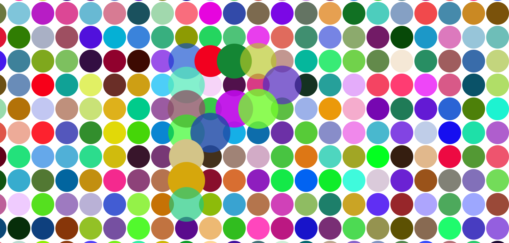

# Pop It - Interactive Bubble Grid

A fun and visually engaging bubble popping animation. Resize the window, and watch bubbles regenerate in random colors!

## Demo

Check out the live demo: [Pop It Demo](https://popit.igneczitibor.hu)

## Features

- Interactive bubble grid that resizes with the window.
- Smooth animations on hover for a satisfying popping effect.
- Randomly generated bubble colors for a dynamic experience.

## Preview



## Technologies Used

- **HTML5** for structure
- **CSS3** for styling and animations
- **JavaScript** for dynamic bubble creation and color generation

## Installation

Clone this repository to get started:

```bash
git clone https://github.com/sidragosam/popit.git
cd popit
```

Open index.html in your browser to see it in action!

## Usage

Simply open `index.html` in any modern browser. Resize the window to watch the grid adjust automatically.

## Code Overview

- **HTML**: Basic page setup with a `bubbleWrapper` container for bubbles.
- **CSS**: Styling for bubble shapes, hover animations, and a responsive flex layout.
- **JavaScript**:
  - `createBubbles()`: Dynamically generates bubbles to fill the screen based on window size.
  - `getRandomColor()`: Produces random hex colors for each bubble, giving each a unique appearance.

## Customization

- **Bubble Size**: Adjust the `bubbleSize` variable in `script.js` to control bubble density.
- **Color Scheme**: Update `.bubble` styling in `index.css` to modify colors or animations.

## License

This project is licensed under the MIT License.
